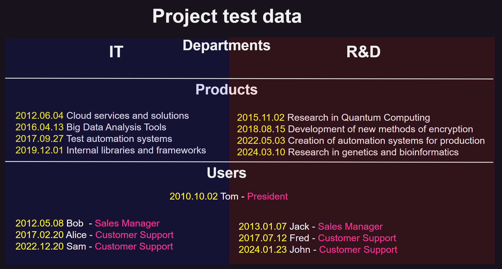
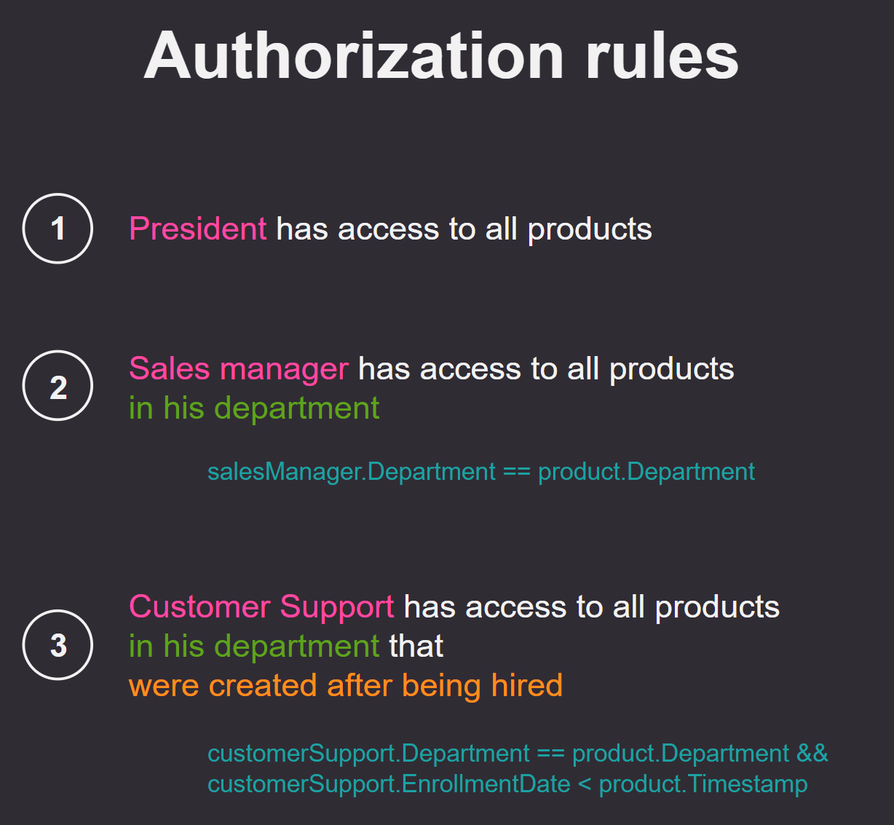

# Description
An example of realization:
- `Authentication`: `cookie`
- `Authorization`: `ABAC` model (`Casbin` library)

## Technologies
- `ASP.NET Core Minimal API`
- `Entity Framework Core`
- `SQLite`
- `Casbin.NET` library (`Authorization` implementation)

## Data
App has such structure with default data:

## Authorization
`Authorization` `ABAC` model uses `attributes` and `rules` to give access to the resource 

After `Authentication` user try to get access to `Products` (`/` address) in DB (`Authorization`) with rules:

According to `Test data` and `Rules` `Users` will get access:
- President
  - Tom (8 products)
- IT department
  - Bob  (4 products)
  - Alice (2 products)
  - Sam (0 products)
- R&D department
  - Jack (4 products)
  - Fred (3 products)
  - John (1 product)
